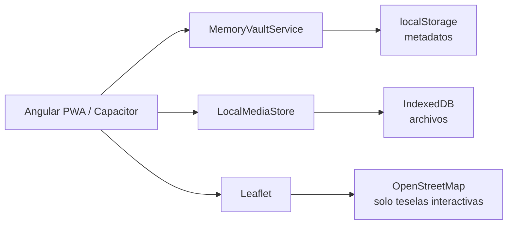
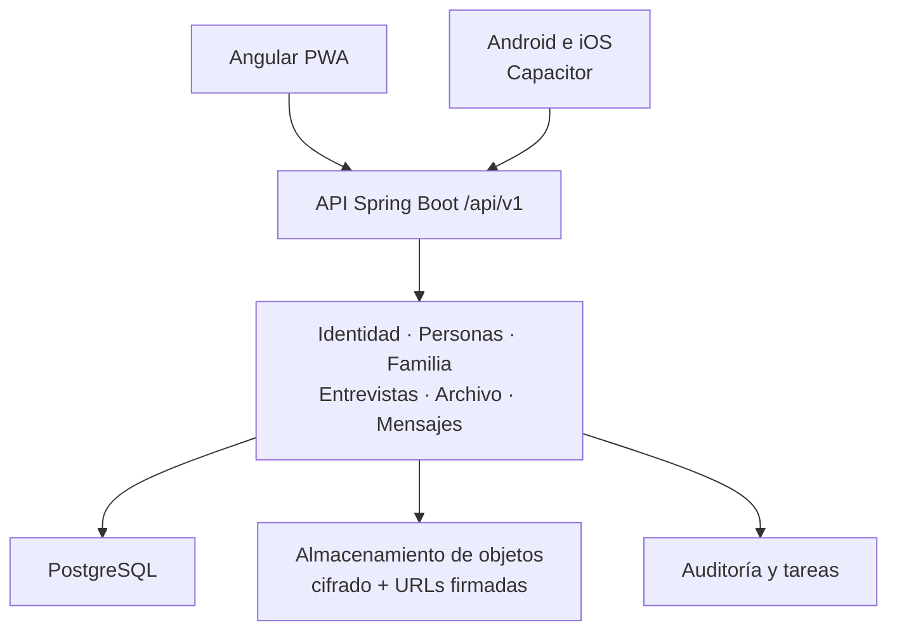

# Arquitectura de MindSage

## Dos modos, una interfaz

La PWA de Angular funciona hoy de forma local en GitHub Pages y está preparada para sustituir sus
adaptadores locales por una API sin rehacer las pantallas.

En la demostración:

- `MemoryVaultService` aplica las reglas de edición y serializa la bóveda local;
- `LocalMediaStore` conserva blobs sin convertirlos a base64;
- el navegador solicita consentimiento antes de grabar el micrófono;
- el explorador invitado solo recibe vistas filtradas de contenido público;
- registro, mensajes, reclamaciones y permisos simulan el flujo de producto, pero no una frontera de
  seguridad.

La arquitectura objetivo mantiene un monolito modular durante la primera etapa:

## Capas

| Capa | Responsabilidad |
|---|---|
| `apps/web` | PWA adaptable, accesibilidad, estado local y envoltorio móvil |
| `apps/api` | reglas del dominio, autorización por recurso, contratos HTTP y persistencia |
| Flyway | evolución versionada del esquema |
| `tools` | comprobaciones independientes de la aplicación |
| GitHub Actions | pruebas, compilación y publicación de la demo |

## Módulos del backend

Los paquetes actuales son cortes verticales pequeños:

- `people`: identidad biográfica y consultas públicas;
- `chronicle`: cronología y acontecimientos vitales;
- `wisdom`: reflexiones y recomendaciones;
- `shared`: persistencia y errores transversales;
- `config`: límites HTTP, CORS y seguridad.

Los siguientes cortes serán `identity`, `claims`, `family`, `places`, `interviews`, `media`,
`messaging`, `consent` y `provenance`. Cada módulo expondrá casos de uso y DTO; las entidades de
persistencia no se serializarán directamente.

## Persistencia

SQLite es adecuado para desarrollo, demostraciones locales y uso individual sin servidor. No es una
base compartida por navegadores ni puede recibir escrituras desde GitHub Pages. La versión
multiusuario usará PostgreSQL para metadatos y almacenamiento de objetos para archivos grandes.

Los binarios no se guardan en SQL. La base conserva propietario, permisos, hash de integridad,
ubicación y metadatos. Las cargas se realizarán con URLs firmadas de corta duración y una fase de
cuarentena y análisis.

## Contratos y seguridad

La API comienza en `/api/v1`. Cualquier escritura real exige autenticación, autorización sobre el
recurso, validación de consentimiento y auditoría. El contrato previsto se detalla en
[PRODUCTION_CONTRACT.md](PRODUCTION_CONTRACT.md).
