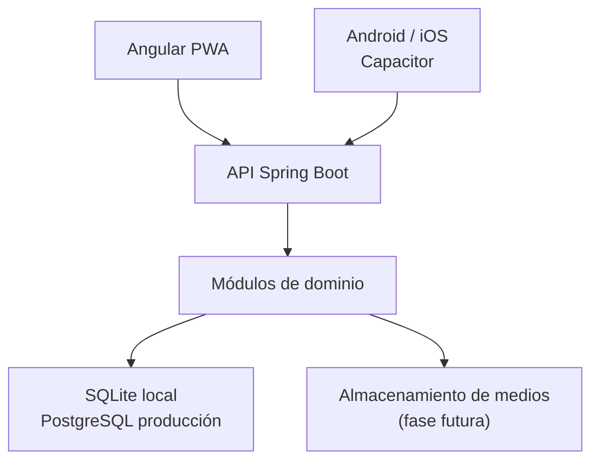

# Arquitectura de MindSage

## Decisión principal

MindSage adopta un monolito modular para la primera etapa. Mantiene una sola API desplegable, pero
separa el código por capacidades del dominio. Evita el coste operativo de microservicios prematuros
y deja límites claros para extraer módulos cuando el volumen lo justifique.

## Capas

| Capa | Responsabilidad |
|---|---|
| `apps/web` | Experiencia web adaptable, PWA, estado local y envoltorio móvil |
| `apps/api` | Reglas del dominio, autorización, contratos HTTP y persistencia |
| Flyway | Evolución versionada y reproducible de la base de datos |
| `tools` | Comprobaciones auxiliares independientes de la aplicación |
| GitHub Actions | Pruebas, compilación y publicación de la demo |

## Módulos del backend

Los paquetes actuales son cortes verticales pequeños:

- `people`: identidad biográfica y consultas públicas;
- `chronicle`: cronología y acontecimientos vitales;
- `wisdom`: reflexiones y recomendaciones;
- `shared`: persistencia y errores transversales;
- `config`: límites HTTP, CORS y seguridad.

Los siguientes cortes naturales serán `interviews`, `media`, `family`, `places`, `consent`,
`provenance` y `identity`. Cada módulo deberá exponer casos de uso, no sus entidades JPA.

## Persistencia

SQLite es adecuado para desarrollo, demostraciones locales y uso individual sin servidor. No es una
base de datos compartida por los navegadores ni puede recibir escrituras desde GitHub Pages.
Producción usará PostgreSQL y almacenamiento de objetos para archivos grandes. Las dos bases
comparten migraciones SQL compatibles siempre que sea posible; las diferencias específicas se
introducirán en migraciones por plataforma cuando sean necesarias.

## Contratos y versiones

La API pública comienza en `/api/v1`. Las respuestas usan DTO inmutables; las entidades no se
serializan directamente. Las operaciones de escritura permanecerán cerradas hasta disponer de
autenticación, autorización por recurso, auditoría y controles de consentimiento.

